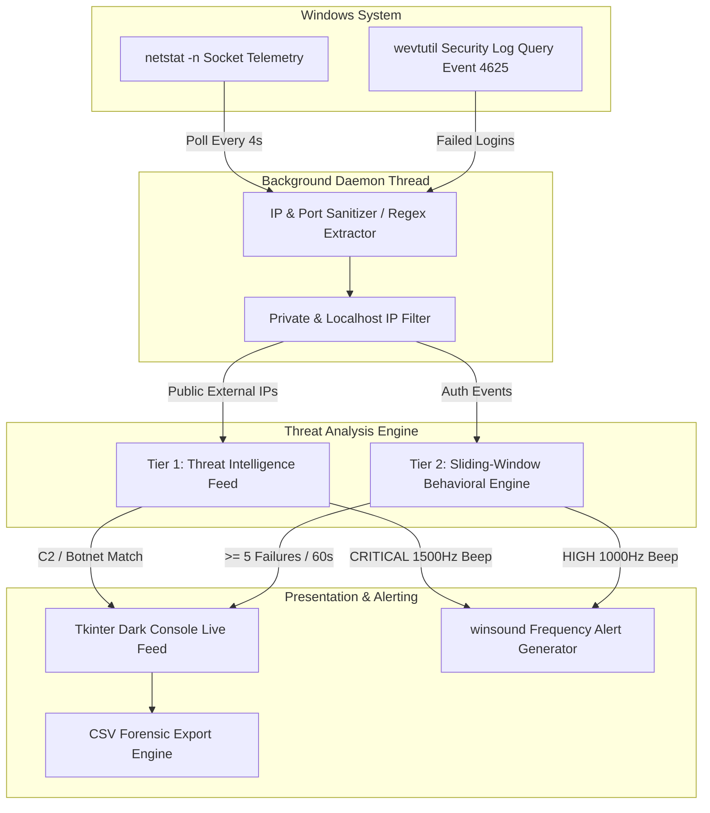

# 🛡️ Threat Analysis & Network Log Intelligence System

[](https://www.microsoft.com/windows)
[](https://www.python.org/)
[](https://docs.python.org/3/library/tkinter.html)
[](LICENSE)
[](https://git-lfs.github.com)

An automated Windows threat detection and network log intelligence system. It combines live socket telemetry, Windows Event Log auditing, behavioral anomaly detection (brute-force monitoring), and static Threat Intelligence feeds to alert administrators against malicious activity in real-time.

---

## 📑 Table of Contents

- [Overview](#-overview)
- [System Architecture](#-system-architecture)
- [Core Detection Engines](#-core-detection-engines)
  - [1. Real-Time Network Telemetry (`netstat`)](#1-real-time-network-telemetry-netstat)
  - [2. Threat Intelligence (TI) Feed Matching](#2-threat-intelligence-ti-feed-matching)
  - [3. Windows Security Event Log Auditing (`wevtutil`)](#3-windows-security-event-log-auditing-wevtutil)
  - [4. Sliding-Window Behavioral Analysis (Brute-Force)](#4-sliding-window-behavioral-analysis-brute-force)
- [Alert System & Severity Matrix](#-alert-system--severity-matrix)
- [GUI & User Interface](#-gui--user-interface)
- [Forensic CSV Export](#-forensic-csv-export)
- [Installation & Setup](#-installation--setup)
- [Usage Guide](#-usage-guide)
- [Building Standalone Executable & Installer](#-building-standalone-executable--installer)
- [Configuration & Tuning](#-configuration--tuning)
- [Project Structure](#-project-structure)
- [Security & Best Practices](#-security--best-practices)

---

## 🔍 Overview

Modern endpoints require continuous telemetry without heavyweight resource overhead. The **Threat Analysis & Network Log Intelligence System** acts as a lightweight Security Information and Event Management (SIEM) agent tailored specifically for Windows environments.

The agent runs as a multi-threaded daemon that:
- Inspects network sockets every 4 seconds to extract active external connections.
- Correlates remote IP addresses with known Command-and-Control (C2), botnet, and ransomware infrastructure.
- Queries Windows Security Logs for logon failures (Event ID `4625`).
- Evaluates event velocity using sliding-window algorithms to catch rapid brute-force attacks.
- Streams live telemetry to an interactive, dark terminal console with distinct audio frequencies.
- Exports structured security events into standard CSV format for forensic and SIEM ingestion.

---

## 🏗️ System Architecture



---

## ⚙️ Core Detection Engines

### 1. Real-Time Network Telemetry (`netstat`)
- **Execution Mechanism:** Executes `netstat -n` in the background with `CREATE_NO_WINDOW` flags (`0x08000000`) to prevent intrusive command prompt popups.
- **Connection States:** Filters for sockets in `ESTABLISHED` (active ongoing session) and `SYN_SENT` (outbound connection attempt).
- **IP Sanitization:** Cleans IPv6 brackets and strips ports.
- **Noise Filtering:** Discards loopback (`127.0.0.1`, `0.0.0.0`) and RFC 1918 private address spaces (`10.0.0.0/8`, `172.16.0.0/12`, `192.168.0.0/16`) to isolate external public traffic.
- **Deduplication:** Maintains an in-memory session set of observed IPs to prevent redundant alert spam.

### 2. Threat Intelligence (TI) Feed Matching
- Evaluates inbound/outbound external addresses against an integrated threat database.
- Identifies adversary infrastructure categories:
  - Known Malware Command & Control (C2) servers
  - Distributed Denial of Service (DDoS) / Botnet nodes
  - Suspicious vulnerability scanners
  - Ransomware staging and distribution endpoints
- Immediate dispatch: Flagged connections instantly trigger a **CRITICAL** alert.

### 3. Windows Security Event Log Auditing (`wevtutil`)
- **Target Event:** Windows Security Event ID `4625` (An account failed to log on).
- **Query Method:** Runs `wevtutil qe Security /q:"*[System[(EventID=4625)]]" /c:1 /rd:true /f:text`.
- **Fail-Safe Design:** Wrapped in exception handlers; if launched under standard (non-admin) privileges, the system gracefully bypasses the locked security log without crashing.

### 4. Sliding-Window Behavioral Analysis (Brute-Force)
- **Time Window (`TIME_WINDOW_SECONDS`):** `60 seconds`
- **Threshold (`FAILED_LOGIN_THRESHOLD`):** `5 failed attempts`
- **Algorithm:**
  1. Each failed login timestamp is recorded in a per-IP deque.
  2. Events older than 60 seconds are purged on each tick.
  3. When an IP's record count reaches 5 or more within the 60-second sliding window, a **HIGH** severity alert is generated and the IP's counter is reset.

---

## 🚨 Alert System & Severity Matrix

| Severity | Condition / Trigger | Audio Pitch | Audio Duration | Action Required |
|:---|:---|:---:|:---:|:---|
| **CRITICAL** | External IP matches known Threat Intel blacklist (C2, Botnet, Ransomware) | `1500 Hz` | `1000 ms` | Immediate host isolation; review process binding with PID |
| **HIGH** | $\ge 5$ failed login attempts from same IP within $60\text{s}$ (Brute-Force) | `1000 Hz` | `500 ms` | Check target account; verify lockout policy or firewall drop |
| **INFO / INGEST** | Normal live outbound connection observed | *Muted* | — | Logged to console for audit trail |

---

## 🖥️ GUI & User Interface

The application features a dark console with high-contrast terminal styling:
- **Display Area:** `Consolas` font on a high-contrast black/neon-green background (`#000000` / `#90EE90`).
- **Thread-Safe Architecture:** Uses `root.after()` dispatchers to guarantee GUI stability when receiving events from background monitoring threads.
- **One-Click Controls:**
  - `Start / Stop Real PC Network Monitor`: Toggles the background detection daemon.
  - `Export Alerts to CSV`: Opens Windows file dialog to export collected alerts.

---

## 📊 Forensic CSV Export

When choosing **Export Alerts to CSV**, all generated security alerts are written with full headers:

| Field | Description | Example |
|:---|:---|:---|
| `timestamp` | Exact local time the event triggered | `14:23:05` |
| `severity` | Threat classification | `CRITICAL` or `HIGH` |
| `title` | Attack category | `Malicious IP Interaction` |
| `description` | Diagnostic details, IP, and feed source | `Traffic from known bad IP: 45.33.32.156. Intel: Ransomware Distribution server` |

---

## 📦 Installation & Setup

### Prerequisites
- **Operating System:** Windows 10 or Windows 11 (64-bit recommended)
- **Python:** Version 3.8 or later
- **Git & Git LFS:** Recommended for cloning with prebuilt binaries

### 1. Clone the Repository
```powershell
git clone https://github.com/jesinmilesh/Threat-Analysis.git
cd "Threat-Analysis"
```

### 2. Verify Python Dependencies
The core application relies entirely on standard Python libraries:
- `tkinter` (GUI)
- `subprocess` (System utilities invocation)
- `threading` (Concurrent scanner loop)
- `winsound` (Native Windows audio signals)
- `csv`, `json`, `re`, `collections`, `datetime`

No external `pip` dependencies are strictly required to run from source.

---

## 🚀 Usage Guide

### Running from Python Source
To allow the tool to read Windows Security Event Logs (`Event ID 4625`), **open PowerShell or Command Prompt as Administrator**:

```powershell
python threat_analysis.py
```

1. Click **Start Real PC Network Monitor**.
2. The console will display:
   ```text
   [SYSTEM] Initiating Live Deep Packet Diagnostics (netstat binding)...
   [INGEST] 2026-09-25 10:30:00 - IP: 203.0.113.42 - Action: LIVE_CONNECTION - User: SYSTEM
   ```
3. If an alert occurs, the audio alarm will sound and a highlighted alert banner will appear in the log.
4. Click **Export Alerts to CSV** anytime to save the incident report.

### Running the Precompiled Executable
If you prefer not to install Python, run the standalone executable located in [`dist/ThreatAnalysis.exe`](dist/ThreatAnalysis.exe):
1. Navigate to `dist/`.
2. Right-click `ThreatAnalysis.exe` and select **Run as Administrator**.

---

## 🔨 Building Standalone Executable & Installer

### 1. Build Executable with PyInstaller
The repository contains [`threat_analysis.spec`](threat_analysis.spec) pre-configured with application icon bundling:

```powershell
pip install pyinstaller
pyinstaller threat_analysis.spec
```
This produces the compiled distribution inside `dist/threat_analysis/`.

### 2. Build Windows Installer with Inno Setup
The project includes [`setup.iss`](setup.iss) for generating an enterprise-ready Windows setup installer:
1. Download and install [Inno Setup 6](https://jrsoftware.org/isdl.php).
2. Open `setup.iss` in Inno Setup Compiler.
3. Click **Build > Compile** (or run `ISCC.exe setup.iss`).
4. The standalone installer `ThreatAnalysis.exe` will be generated in `dist/`.

---

## 🔧 Configuration & Tuning

All detection thresholds and threat intelligence entries can be adjusted directly at the top of [`threat_analysis.py`](threat_analysis.py):

```python
# --- Threshold Adjustments ---
FAILED_LOGIN_THRESHOLD = 5      # Number of failed logins before triggering an alert
TIME_WINDOW_SECONDS = 60        # Sliding evaluation window in seconds

# --- Custom Threat Intelligence Blacklist ---
THREAT_INTEL_BLACKLIST = {
    "192.168.1.100": "Known Malware C2 (Command & Control)",
    "10.0.0.55": "Botnet Activity",
    "203.0.113.42": "Suspicious Scanning IP",
    "45.33.32.156": "Ransomware Distribution server",
    # Add your custom IP feeds or integrate with external APIs here
}
```

---

## 📂 Project Structure

```text
Threat-Analysis/
├── .gitattributes             # Git LFS configuration for binary assets
├── .gitignore                 # Excludes build caches, pycache, and temp directories
├── README.md                  # Comprehensive project documentation
├── setup.iss                  # Inno Setup 6 installer compilation script
├── threat_analysis.py         # Main application logic, detection engines & Tkinter GUI
├── threat_analysis.spec       # PyInstaller build specification
├── threat_logo.ico            # Official application icon
└── dist/
    └── ThreatAnalysis.exe     # Pre-compiled standalone Windows installer (Git LFS)
```

---

## 🛡️ Security & Best Practices

- **Administrator Privileges:** To enable Windows Security Event Log parsing, launch the application as Administrator. Standard user execution will gracefully fall back to network socket inspection only.
- **Extensibility:** The `check_threat_intel()` method can be linked to live Threat Intelligence APIs (such as VirusTotal, AlienVault OTX, or CrowdStrike Falcon) by replacing the dictionary lookup with an authenticated REST query.
- **Enterprise Deployment:** For enterprise SIEM integration, the exported CSV logs can be automatically forwarded via Splunk Universal Forwarder, Elastic Filebeat, or Azure Sentinel.

---

## 📄 License

This project is licensed under the [MIT License](LICENSE).
